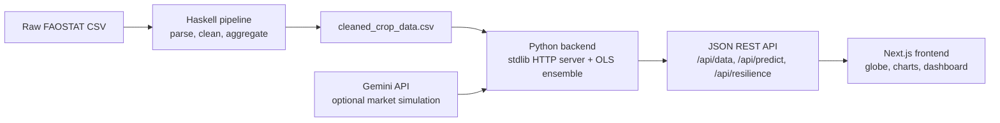

# Project Omni: Climate Resilience Analytics

> Global food-security analytics: FAOSTAT crop yields correlated with temperature anomalies, forecast to 2050.

[](https://github.com/AkashNaickar/ProjectOMNI/actions/workflows/ci.yml)
[](LICENSE)

**Live demo:** [https://project-omni-frontend-zrnk.onrender.com](https://project-omni-frontend-zrnk.onrender.com) · API: [https://project-omni-backend-zrnk.onrender.com](https://project-omni-backend-zrnk.onrender.com)

Project Omni is an end-to-end data intelligence platform that analyzes, predicts, and visualizes the impact of climate change on global agriculture. It correlates decades of FAOSTAT crop-yield data with temperature anomalies to score regional resilience and project yields per country and crop.

## Features

- **Interactive global heatmap** — Leaflet-based globe visualizing crop resilience scores across every continent.
- **Micro-linear forecasting** — 17,000+ independent per-country, per-crop linear regression models projecting yields to 2050.
- **Functional data pipeline** — a Haskell ingestion engine that cleans and formats raw FAOSTAT data with ADT-based domain modeling and `Maybe`/`Either` error handling.
- **Resilience scoring** — detrending algorithms that isolate climate shocks from technological progress into a 0–10 "True Resilience" score.
- **Premium dashboard** — glassmorphic UI built with Next.js, Framer Motion, and Tailwind CSS.

## Architecture



## Tech Stack

| Layer | Technology |
|-------|-----------|
| Data pipeline | Haskell (Stack), pure functional transforms |
| Backend | Python 3 standard library (`http.server`), dependency-free OLS, optional Gemini enrichment |
| Frontend | Next.js 16, React 19, TypeScript, Tailwind CSS 4, Framer Motion, Leaflet, Recharts |
| Deployment | Docker, Render (`render.yaml`) |

**Note on the backend:** the API is implemented with Python's standard library (`http.server` / `BaseHTTPRequestHandler`) — it does **not** use FastAPI or Flask. The only third-party runtime dependencies are `pycountry` (ISO-3 lookup) and the optional `google-generativeai` SDK for market simulation. Heavier models (XGBoost, SARIMAX, Prophet) are loaded opportunistically when installed and gracefully skipped otherwise.

## Quick Start (Docker)

```bash
docker compose up --build
```

- Dashboard: http://localhost:3000
- API: http://localhost:8000/api/metadata

## Quick Start (local)

1. **Pipeline (optional — cleaned data ships in the repo):**
   ```bash
   cd haskell-pipeline && stack run
   ```
2. **Backend:**
   ```bash
   cd python-backend
   python -m venv venv && venv/Scripts/activate   # or source venv/bin/activate
   pip install -r requirements.txt
   python main.py
   ```
3. **Frontend:**
   ```bash
   cd frontend
   npm ci
   npm run dev
   ```

Open http://localhost:3000.

## Environment Variables

| Variable | Service | Required | Description |
|----------|---------|----------|-------------|
| `GEMINI_API_KEY` | backend | No | Enables Gemini-powered market simulation; the API runs without it. |
| `DATA_PATH` | backend | No | Absolute path to `cleaned_crop_data.csv`; defaults to `python-backend/data/cleaned_crop_data.csv`. |
| `PORT` | backend | No | Listen port; defaults to `8000` (Render sets it automatically). |
| `NEXT_PUBLIC_API_URL` | frontend | No | Backend base URL, e.g. `https://project-omni-backend.onrender.com`; defaults to `http://localhost:8000`. |

Copy `.env.example` (create your own locally — never commit real values) or set them in your platform's dashboard.

## Testing

```bash
pip install -r python-backend/requirements.txt pytest
pytest python-backend/tests -q
```

The suite covers the dependency-free OLS model (fit/predict/confidence bands), ISO-3 country resolution, registry integrity, and the bundled dataset shape.

## Deployment

Both services deploy to Render from `render.yaml` (Blueprint):

- `project-omni-backend` — Docker runtime, serves the API.
- `project-omni-frontend` — Docker runtime, serves the dashboard.

Set `GEMINI_API_KEY` and `NEXT_PUBLIC_API_URL` in the Render dashboard after the first deploy.

## Roadmap

- [ ] Replace the stdlib HTTP server with a typed ASGI framework if the API surface grows.
- [ ] Move the cleaned dataset to object storage with lazy download to slim the repo.
- [ ] Add frontend unit tests (Vitest) alongside the backend suite.
- [ ] Cache Gemini simulation responses to cut latency and cost.

## Contributing

1. Fork and create a feature branch (`git checkout -b feat/my-change`).
2. Run `ruff check python-backend --select E4,E7,E9,F` and `pytest python-backend/tests -q` before committing.
3. Open a PR; CI must be green before merge.

## License

[MIT](LICENSE) © Akash Naickar. Created for the Advanced Agentic Coding Hackathon.
